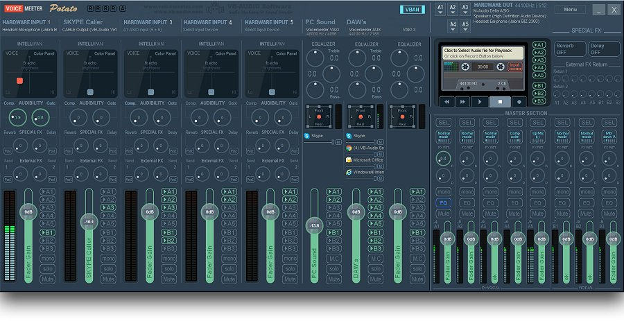

<h1 align="center">
VMR.ahk
</h1>
<p align="center">
  AutoHotkey wrapper class for Voicemeeter Remote API.
</p>

## Getting Started
1.  To use `VMR` in your script, include it using `#Include VMR.ahk` or copy it to a [library folder](https://www.autohotkey.com/docs/Functions.htm#lib) and use `#Include <VMR>`

2.  create an object of the VMR class:
     ```ahk
        voicemeeter := new VMR() 
        ; you can optionally pass the path for voicemeeter's folder -> new VMR("C:\path\to\voicemeeter")
     ```
3.  call the `login()` method:
    ```ahk
        voicemeeter.login()
    ```
4. The `VMR` object will have two arrays, `bus` and `strip`, The length of each array is determined by your Voicemeeter version (VM, VM Banana or VM Potato).
    
    You can use the [bus/strip methods](#busstrip-methods) through these arrays:
    ```ahk
        voicemeeter.bus[1].setMute(True)
    ```
## VMR Object
* <details><summary>bus/strip arrays</summary>

    ## bus/strip arrays
    #### These arrays are used to access [bus/strip methods](#busstrip-methods) to retrieve and change their parameters.

    ```ahk
        voicemeeter.bus[1]
        voicemeeter.strip[4]
    ```
    ## Remarks
    The length of each array is determined by your Voicemeeter version (VM, VM Banana or VM Potato).
    <details><summary><b>Voicemeeter (v1)</b></summary>

    #### Voicemeeter (v1) has 2 output buses and 3 input strips

    
    ###### from left to right: ` strip[1] | strip[2] | strip[3] | bus[1] | bus[2]` where `strip[1]` and`strip[2]`   are physical (hardware) strips and both `bus[1]` and `bus[2]` are physical buses

    </details>

    <details><summary><b>Voicemeeter Banana (v2)</b></summary>

    #### Voicemeeter Banana (v2) has 5 output buses and 5 input strips

    
    ###### from left to right: ` strip[1] | strip[2] | strip[3] | strip[4] | strip[5] | bus[1] | bus[2] | bus[3] |  bus[4] | bus[5] ` where `strip[1-3]` are physical (hardware) strips and `bus[1-3]` are physical buses

    </details>

    <details><summary><b>Voicemeeter Potato (v3)</b></summary>

    #### Voicemeeter Potato (v3) has 8 output buses and 8 input strips

    
    ###### from left to right: ` strip[1] | strip[2] | strip[3] | strip[4] | strip[5] | strip[6] | strip[7] | strip [8] | bus[1] | bus[2] | bus[3] | bus[4] | bus[5] | bus[6] | bus[7] | bus[8] ` where `strip[1-5]` are physical    (hardware) strips and `bus[1-5]` are physical buses

    </details>
</details>

* <details><summary>login</summary>

    ## `login()`
    #### loads VoiceMeeter's Library and calls VM's login function 
    ```ahk
        voicemeeter.login()
    ```
    ## Remarks
    This method needs to be called at startup 
</details>

* <details><summary>restart</summary>

    ## `restart()`
    #### Restarts VoiceMeeter's Audio Engine and refetches devices lists 
    ```ahk
        voicemeeter.restart()
    ```
</details>

* <details><summary>getType</summary>

    ## `getType()`
    #### Returns Voicemeeter version/type
    ```ahk
       vmType := voicemeeter.getType()
    ```
    # Remarks
    `1` : Voicemeeter

    `2` : Voicemeeter Banana

    `3` : Voicemeeter Potato
</details>

## bus/strip methods
* Gain methods
    * <details><summary>setGain</summary>

        ## `setGain(gain)`
        #### Sets the bus/strip's gain to a specific dB value 
        ## Parameters
        `gain` : gain value in dB (range between -60.0 and 12.0)
        ## Example
        ```ahk
            voicemeeter.bus[1].setGain(12)
            voicemeeter.strip[2].setGain(2.4)
        ```
    </details>

    * <details><summary>getGain</summary>

        ## `getGain()`
        #### Returns the bus/strip's current gain value in dB 
        ## Example
        ```ahk
            dB := voicemeeter.bus[1].getGain()
            dB := voicemeeter.strip[7].getGain()
        ```
    </details>

    * <details><summary>getGainPercentage</summary>

        ## `getGainPercentage()`
        #### Returns the bus/strip's current gain value as a scalar percentage
        ## Example
        ```ahk
            gain := voicemeeter.bus[1].getGainPercentage()
            gain := voicemeeter.strip[7].getGainPercentage()
        ```
    </details>
    
    * <details><summary>incGain</summary>

        ## `incGain()`
        #### Increases the bus/strip's gain by 1.2 dB and returns the new gain value in dB
        ## Example
        ```ahk
            voicemeeter.bus[3].incGain()
            dB := voicemeeter.strip[2].incGain()
        ```
    </details>

    * <details><summary>decGain</summary>

        ## `decGain()`
        #### Decreases the bus/strip's gain by 1.2 dB and returns the new gain value in dB
        ## Example
        ```ahk
            voicemeeter.bus[3].decGain()
            dB := voicemeeter.strip[2].decGain()
        ```
    </details>

* Mute methods
    * <details><summary>setMute</summary>

        ## `setMute(mute)`
        #### Sets the bus/strip's mute state
        ## Parameters
        `mute` : boolean (`true` / `1` -> mute ; `false` / `0` -> unmute)
        ## Example
        ```ahk
            voicemeeter.bus[1].setMute(1)
            voicemeeter.strip[2].setMute(false)
        ```
    </details>

    * <details><summary>getMute</summary>

        ## `getMute()`
        #### Returns the bus/strip's current mute state 
        ## Example
        ```ahk
            mute := voicemeeter.bus[1].getMute()
            mute := voicemeeter.strip[7].getMute()
        ```
    </details>

    * <details><summary>toggleMute</summary>

        ## `toggleMute()`
        #### Toggles the bus/strip's mute state and returns it
        ## Example
        ```ahk
            mute := voicemeeter.bus[1].toggleMute()
            voicemeeter.strip[2].toggleMute()
        ```
    </details>

* Device methods
    * <details><summary>setDevice</summary>

        ## `setDevice(name, driver)`
        #### Sets the bus/strip's audio device
        ## Parameters
        `name` : The audio device's name or any part of it

        `driver` : The audio driver used for the device (`"wdm"`, `"mme"`, `"asio"`, `"ks"`)
        ## Example
        ```ahk
            voicemeeter.bus[1].setDevice("LG", "mme")
            voicemeeter.strip[2].setDevice("corsair hs70", "wdm")
        ```
    </details>

    * <details><summary>getDevice</summary>

        ## `getDevice()`
        #### Returns the bus/strip's current audio device
        ## Example
        ```ahk
            device := voicemeeter.bus[1].getDevice()
            device := voicemeeter.strip[2].getDevice()
        ```
    </details>
* Generic parameter methods
    * <details><summary>setParameter</summary>

        ## `setParameter(parameter, value)`
        #### Sets the bus/strip's specified parameter to a value
        ## Parameters
        `parameter` : The name of a parameter (see [VM docs](https://download.vb-audio.com/Download_CABLE/VoicemeeterRemoteAPI.pdf))

        `value` : The value to be set to the parameter
        ## Example
        ```ahk
            voicemeeter.bus[1].setParameter("FadeTo", "(6.0, 2000)")
            voicemeeter.strip[2].setParameter("A1", 1)
        ```
    </details>

    * <details><summary>getParameter</summary>

        ## `getParameter(parameter)`
        #### Returns the bus/strip's specified parameter's value
        ## Parameters
        `parameter` : The name of a parameter (see [VM docs](https://download.vb-audio.com/Download_CABLE/VoicemeeterRemoteAPI.pdf))
        ## Example
        ```ahk
            voicemeeter.bus[1].getParameter("mode.normal")
            voicemeeter.strip[2].getParameter("Pan_x")
        ```
    </details>
