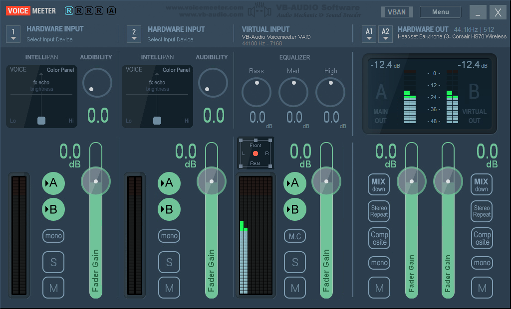
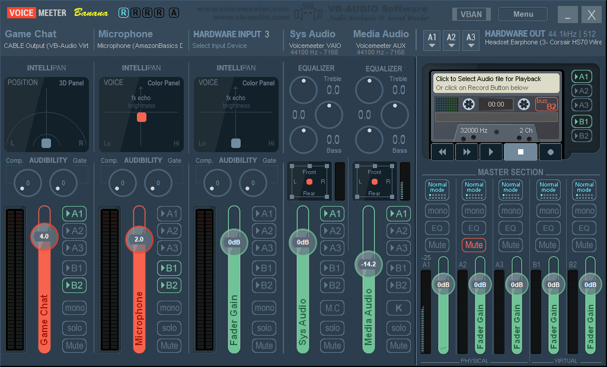
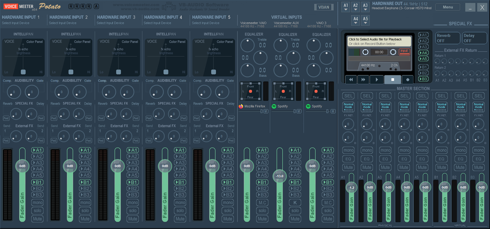

<h1 align="center">
VMR.ahk
</h1>
<p align="center">
  AutoHotkey wrapper class for Voicemeeter Remote API.
</p>

## Getting Started
1.  To use `VMR` in your script, include it using `#Include VMR.ahk` or copy it to a [library folder](https://www.autohotkey.com/docs/Functions.htm#lib) and use `#Include <VMR>`

2.  create an object of the VMR class:
     ```ahk
        voicemeeter := new VMR() 
        ; you can optionally pass the path for voicemeeter's folder -> new VMR("C:\path\to\voicemeeter")
     ```
3.  call the `login()` method:
    ```ahk
        voicemeeter.login()
    ```
4. The `VMR` object will have two arrays, `bus` and `strip`, The length of each array is determined by your Voicemeeter version (VM, VM Banana or VM Potato).
    
    You can control Voicemeeter's bus/strip parameters through these arrays:
    ```ahk
        voicemeeter.bus[1].mute:= true
    ```

## `VMR` Object
* <details><summary>bus/strip Arrays</summary>

    ## `bus`/`strip` Arrays
    #### array of [`bus`/`strip` objects](#busstrip-object)

    ```ahk
        voicemeeter.bus[1]
        voicemeeter.strip[4]
    ```
    ## Remarks
    The length of each array is determined by your Voicemeeter version (VM, VM Banana or VM Potato).
    <details><summary><b>Voicemeeter (v1)</b></summary>

    #### Voicemeeter (v1) has 2 output buses and 3 input strips

    
    ###### from left to right: ` strip[1] | strip[2] | strip[3] | bus[1] | bus[2]` where `strip[1]` and`strip[2]`   are physical (hardware) strips and both `bus[1]` and `bus[2]` are physical buses

    </details>

    <details><summary><b>Voicemeeter Banana (v2)</b></summary>

    #### Voicemeeter Banana (v2) has 5 output buses and 5 input strips

    
    ###### from left to right: ` strip[1] | strip[2] | strip[3] | strip[4] | strip[5] | bus[1] | bus[2] | bus[3] |  bus[4] | bus[5] ` where `strip[1-3]` are physical (hardware) strips and `bus[1-3]` are physical buses

    </details>

    <details><summary><b>Voicemeeter Potato (v3)</b></summary>

    #### Voicemeeter Potato (v3) has 8 output buses and 8 input strips

    
    ###### from left to right: ` strip[1] | strip[2] | strip[3] | strip[4] | strip[5] | strip[6] | strip[7] | strip [8] | bus[1] | bus[2] | bus[3] | bus[4] | bus[5] | bus[6] | bus[7] | bus[8] ` where `strip[1-5]` are physical    (hardware) strips and `bus[1-5]` are physical buses

    </details>
</details>

* <details><summary>command Object</summary>

    ## [`command` Object](#command-object-1)
    #### Use this object to access command methods
    ```ahk
        voicemeeter.command.restart()
        voicemeeter.command.load(filePath)
    ```
</details>

* <details><summary>recorder Object</summary>

    ## [`recorder` Object](#recorder-object-1)
    #### Use this object to control Voicemeeter's recorder
    ```ahk
        voicemeeter.recorder.record:= 1
        voicemeeter.recorder.stop:= 1
    ```
</details>

* <details><summary>login</summary>

    ## `login()`
    #### loads VoiceMeeter's Library and calls VM's login function 
    ```ahk
        voicemeeter.login()
    ```
    ## Remarks
    This method needs to be called at startup 
</details>

* <details><summary>getType</summary>

    ## `getType()`
    #### Returns Voicemeeter version/type
    ```ahk
       vmType := voicemeeter.getType()
    ```
    ## Return value
    `1` : Voicemeeter

    `2` : Voicemeeter Banana

    `3` : Voicemeeter Potato
</details>

## `bus`/`strip` Object
* <details><summary>Level Array</summary>

    ## `level` Array
    #### contains the current level (in dB) for every channel a bus/strip has.
    ## Remarks
    The array length depends on the type of bus/strip. Hardware (physical) strips have 2 channels (left, right), Buses and virtual strips have 8 channels.
    ## Example
    ```ahk
        level := voicemeeter.bus[1].level[1] ; gets the level of the front left channel.
    ```
    
    You can use \* with max to get the highest level input to a channel.
    ```ahk
        maxLevel := Max(voicemeeter.bus[1].level*)
    ```
    
    
</details>

* <details><summary>Gain Property</summary>

    ## `gain` property
    #### Change the property value to adjust the gain
    ```ahk
        voicemeeter.bus[1].gain:= 8.5
        dB:= voicemeeter.bus[1].gain ;8.5
    ```
    #### Increment/decrement the property value to increase/decrease the gain
    ```ahk
        db:= ++voicemeeter.bus[1].gain
        voicemeeter.bus[1].gain--
        voicemeeter.strip[4].gain += 4.5
    ```
</details>

* <details><summary>Mute Property</summary>

    ## `mute` property
    #### Change the property value to mute/unmute
    ```ahk
        voicemeeter.bus[1].mute:= 1
        voicemeeter.strip[2].mute:= 0
        isMuted:= voicemeeter.bus[1].mute ;1
    ```
    #### Toggle mute parameter by setting the value to `-1`
    ```ahk
        voicemeeter.bus[1].mute:= 1
        voicemeeter.bus[1].mute:= -1
        isMuted:= voicemeeter.bus[1].mute ;0
    ```
</details>

* <details><summary>Device Property</summary>

    ## `device` property
    #### Set the bus/strip's device by setting the property value to the device's name or any part of it
    ```ahk
        voicemeeter.bus[1].device:= "LG" ;sets bus[1] to the first device with "LG" in its name using "wdm" driver
        voicemeeter.strip[2].device["mme"]:= "Corsair HS70" ;specify which driver to use using device[driver]
    ```
    #### Get the bus/strip's current device name
    ```ahk
        device:= voicemeeter.bus[1].device
    ```
</details>

* <details><summary>Methods</summary>

    * <details><summary>getGainPercentage method</summary>

        ## `getGainPercentage()`
        #### Returns the bus/strip's current gain value as a scalar percentage
        ## Example
        ```ahk
            voicemeeter.bus[1].gain:= 0.0
            gainPercentage := voicemeeter.bus[1].getGainPercentage() ;100.0
        ```
        </details>

    * <details><summary>setParameter method</summary>

        ## `setParameter(parameter, value)`
        #### Sets the value of a bus/strip parameter
        ## Parameters
        `parameter` : The name of a parameter (see [VM docs](http://download.vb-audio.com/Download_CABLE/VoicemeeterRemoteAPI.pdf#page=8&zoom=auto,-108,691))
        
        `value` : The value to be set to the parameter
        ## Example
        ```ahk
            voicemeeter.bus[1].setParameter("FadeTo", "(6.0, 2000)")
            voicemeeter.strip[2].setParameter("A1", 1)
        ```
        </details>

    * <details><summary>getParameter method</summary>

        ## `getParameter(parameter)`
        #### Returns the value of a bus/strip parameter
        ## Parameters
        `parameter` : The name of a parameter (see [VM docs](http://download.vb-audio.com/Download_CABLE/VoicemeeterRemoteAPI.pdf#page=8&zoom=auto,-108,691))
        ## Example
        ```ahk
            voicemeeter.bus[1].getParameter("mode.normal")
            voicemeeter.strip[2].getParameter("Pan_x")
        ```
        </details>
        
</details>

## `command` Object
* <details><summary>show</summary>

    ## `show(open)`
    #### Show Voicemeeter's window
    ## Example
    ```ahk
        voicemeeter.command.show()
    ```
    `open` is not required. If passed zero, Voicemeeter will close its open window.
</details>

* <details><summary>restart</summary>

    ## `restart()`
    #### Restart Voicemeeter's Audio Engine
    ## Example
    ```ahk
        voicemeeter.command.restart()
    ```
</details>

* <details><summary>shutdown</summary>

    ## `shutdown()`
    #### Shutdown Voicemeeter
    ## Example
    ```ahk
        voicemeeter.command.shutdown()
    ```
</details>

* <details><summary>reset</summary>

    ## `reset()`
    #### Reset All configuration
    ## Example
    ```ahk
        voicemeeter.command.reset()
    ```
</details>

* <details><summary>eject</summary>

    ## `eject()`
    #### Eject Cassette
    ## Example
    ```ahk
        voicemeeter.command.eject()
    ```
</details>

* <details><summary>save/load</summary>

    ## `save(fileName)`/`load(fileName)`
    #### Save/Load Voicemeeter's configuration to/from a file
    ## Example
    ```ahk
        voicemeeter.command.save("C:\config.xml")
        voicemeeter.command.load("C:\config.xml")
    ```
    ## Parameters
    `fileName` : Name of the file to save/load the configuration to/from, if the path is not specified, the file is assumed to be in the user's Documents folder
</details>

* <details><summary>Button Object</summary>
  
  * <details><summary>state</summary>
  
    ## `button[i].state(onOff)`
    #### Change the actual state of the button
    ## Example
    ```ahk
        voicemeeter.command.button[3].state(1) ; sets the state to pressed, runs the macro code
    ```

  * <details><summary>stateOnly</summary>

    ## `button[i].stateOnly(onOff)`
    #### Change the visual state of the button
    ## Example
     ```ahk
        voicemeeter.command.button[3].stateonly(0)
        ; releases the key but does not run the release code programmed into the macrobutton.
    ```
  
  * <details><summary>trigger</summary>

    ## `button[i].trigger(onOff)`
    #### Change the state of the volume
    ## Example
    ```ahk
        voicemeeter.command.button[3].trigger(1) ; enables the trigger. This means the macro can run at a specific volume. 
    ```
  </details>
  
</details>

## `recorder` Object

* <details><summary>parameters</summary>

    ## Set/Get the value of a [recorder parameter](http://download.vb-audio.com/Download_CABLE/VoicemeeterRemoteAPI.pdf#page=11&zoom=auto,-108,813)
    ```ahk
        voicemeeter.recorder.record:= 1
        voicemeeter.recorder.A5:= 1
        voicemeeter.recorder["mode.MultiTrack"]:= 0 ;use bracket syntax for parameters with '.' in their name
    ```
</details>

* <details><summary>methods</summary>


    * <details><summary>ArmBus method</summary>

        ## `ArmBus(index, set:=-1)`
        #### Changes the recording mode to 1 (bus) and arms/disarms the given bus
        ```ahk
            voicemeeter.recorder.ArmBus(3,true)
        ```
        #### if the `set` parameter is not passed, it will return the state of the given bus (armed/disarmed)
        ```ahk
            isArmed:= voicemeeter.recorder.ArmBus(2)
        ```
        </details>

    * <details><summary>ArmStrip method</summary>

        ## `ArmStrip(index, set:=-1)`
        #### Changes the recording mode to 0 (strip) and arms/disarms the given strip
        ```ahk
            voicemeeter.recorder.ArmStrip(1,true)
            voicemeeter.recorder.ArmStrip(2,false)
        ```
        #### if the `set` parameter is not passed, it will return the state of the given strip (armed/disarmed)
        ```ahk
            isArmed:= voicemeeter.recorder.ArmStrip(5)
        ```
        </details>

    * <details><summary>ArmStrips method</summary>

        ## `ArmStrips(index*)`
        #### Arms the given strips, disarming the others
        ```ahk
            voicemeeter.recorder.ArmStrip(2,true) ;2->armed
            voicemeeter.recorder.ArmStrips(1,3,5) ;2->disarmed 1,3,5->armed
        ```
        </details>

</details>

## `VBAN` Object

* <details><summary>parameters</summary>

    ## Set/Get the value of a [vban parameter](http://download.vb-audio.com/Download_CABLE/VoicemeeterRemoteAPI.pdf#page=17&zoom=auto,-108,813)
    ```ahk
        voicemeeter.vban.instream[2].on := 0 ; turns off instream 2
        voicemeeter.vban.outstream[3].name:= "Music" ; set outstream3 name to Music 
        voicemeeter.vban.enable:= 1 ; enable vban 
    ```
</details>

* <details><summary>Stream Objects</summary>


    ## `instream`/`outstream` Objects
    #### Interfaces with vban streams. Use `vban.instream[i]` and `vban.outstream[i]`.
    ```ahk
        voicemeeter.vban.instream[1].ip := "127.0.0.1"
        voicemeeter.vban.outstream[6].channel := 2
    ```
    #### Retrieve the state of a stream parameter
    ```ahk
        streamOn:= voicemeeter.vban.instream[0].on
    ```

</details>

## `Macro Buttons` Object

* <details><summary>setStatus</summary>

    ## `setStatus(nuLogicalButton, onOff, bitmode)`
    #### Set the status of a [macro button](http://download.vb-audio.com/Download_CABLE/VoicemeeterRemoteAPI.pdf#page=8&zoom=auto,-108,813)
   
    ```ahk
        voicemeeter.macroButton.setStatus(1,1,3) ; sets macro button 1 to have trigger on
        voicemeeter.macroButton.setStatus(2,1,1) ; set macrobutton 2 to on.
    ```
    
</details>

* <details><summary>getStatus</summary>

    ## `getStatus(nuLogicalButton, bitmode)`
    #### Get the status of a [macro button](http://download.vb-audio.com/Download_CABLE/VoicemeeterRemoteAPI.pdf#page=8&zoom=auto,-108,813)
   
    ```ahk
        buttonStatus:= voicemeeter.macroButton.getStatus(1,3)
    ```

</details>
